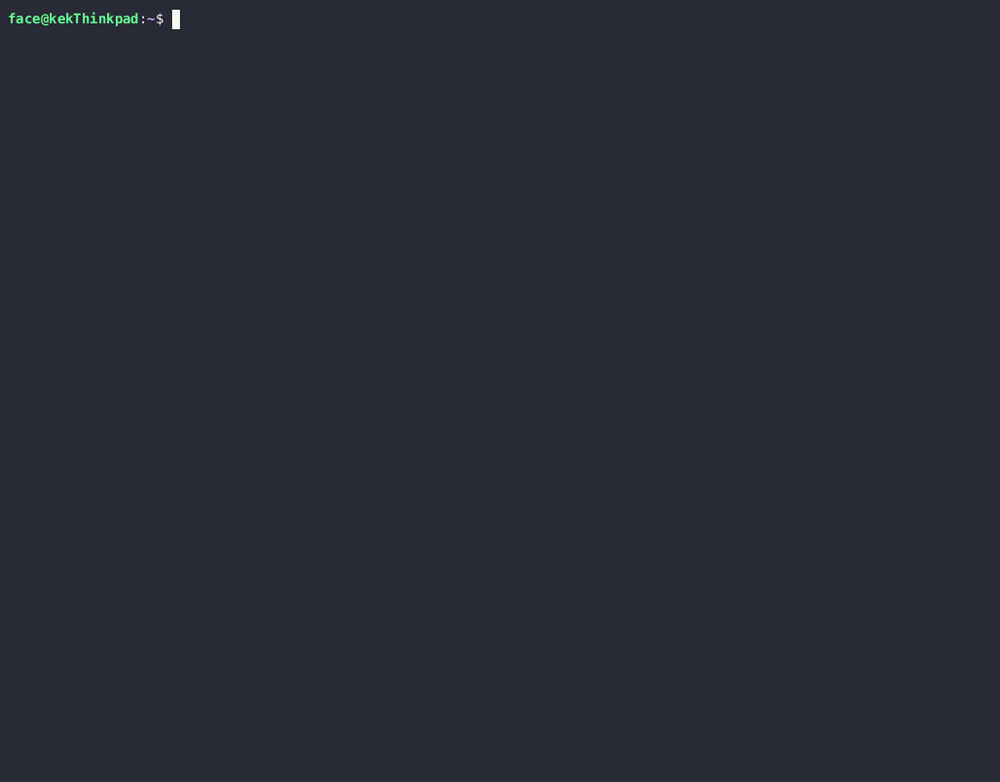

# shell-toy

A `fortune | cowsay` implementation in Rust.

_**THIS IS STILL A WIP**_

(Pardon the glitches, those are from the asciinema recording)

## Installation

You can get pre-built binaries, including ones containing the default `cowsay` and `fortune` package resources embedded in the releases section.

Via Cargo (this builds a barebones binary):
MSRV: Rust 1.95

```
cargo install shell-toy
```

This will install shell-toy to your local path as `sh-toy`. You can then put it in whatever terminal startup script you want.

## Cargo Features & Environment Flags

There are some compile-time features that enable shell-toy to perform certain things such as using an internal copy of fortunes embedded in the executable. This can be customized based on what you want. More details are below:

| Feature              | Description                                                                                                                                             |
| -------------------- | ------------------------------------------------------------------------------------------------------------------------------------------------------- |
| `inline-fortune`     | Enables inlining fortunes in the compiled `sh-toy` executable. See [Compiling with Inline Things](#compiling-with-inline-things) for more details       |
| `inline-off-fortune` | Also inlines Offensive fortunes. These are still blocked behind the `-o` flag                                                                           |
| `inline-cowsay`      | Enables inlining cowsay files in the compiles `sh-toy` executable. . See [Compiling with Inline Things](#compiling-with-inline-things) for more details |

There are also some environment variables that the build script does _existence checks_ on which overrides build-script behavior. _Unless specified, the build script will only check if the variable exists and not the value. Remove the variable instead of setting it to 0 in these cases to disable the variable's behavior._

| Env Variable               | Build Script ONLY  | Description                                                                                                                                                                  |
| -------------------------- | ------------------ | ---------------------------------------------------------------------------------------------------------------------------------------------------------------------------- |
| `USE_DEFAULT_RESOURCES`    | :white_check_mark: | Will ignore `COW_PATH` and `FORTUNE_PATH` variables if they exist and instead use resources extracted from the archives defined in `BuildConfig.toml`.                       |
| `FORCE_DOWNLOAD`           | :white_check_mark: | Will redownload resource archives even if they exist. This has no effect if "default resources" are not being used.                                                          |
| `COW_PATH`                 | :x:                | Indicates where to find the cow files to inline in the executable if the `inline-cowsay` feature is enabled.                                                                 |
| `COWSAY_RESOURCE_ZIP_URL`  | :white_check_mark: | URL linking to a ZIP archive where fortunes can be extracted from by default. Defaults to the master branch of [cowsay-org/cowsay](https://github.com/cowsay-org/cowsay)     |
| `COWSAY_RESOURCE_PATH`     | :white_check_mark: | When extracting the ZIP archive from `COWSAY_RESOURCE_ZIP_URL`, what path the cowfiles are located in. Has a default value                                                   |
| `EXCLUDED_COWS`            | :white_check_mark: | Names of files to ignore when collecting cowfiles to embed. Has a default value.                                                                                             |
| `FORTUNE_PATH`             | :x:                | Indicates where to find the fortune file(s) to inline in the executable if the `inline-fortune` feature is enabled.                                                          |
| `FORTUNE_RESOURCE_ZIP_URL` | :white_check_mark: | URL linking to a ZIP archive where fortunes can be extracted from by default. Defaults to the master branch of [shlomif/fortune-mod](https://github.com/shlmoif/fortune-mod) |
| `FORTUNE_RESOURCE_PATH`    | :white_check_mark: | When extracting the ZIP archive from `FORTUNE_RESOURCE_ZIP_URL`, what path the fortunes are located in. Has a default value                                                  |
| `EXCLUDED_FORTUNES`        | :white_check_mark: | Names of files to ignore when collecting fortunes to embed.                                                                                                                  |
| `MAX_FORTUNE_LINE_LENGTH`  | :white_check_mark: | The maximum number of characters per line that fortunes embedded in `shell-toy` can have.                                                                                    |
| `MAX_FORTUNE_LINES`        | :white_check_mark: | The maximum number of lines that fortunes embedded in `shell-toy` can have.                                                                                                  |

### Compiling with Inline Things

The build script will look for the following IN THIS ORDER when it comes to using the fortunes:

1. If the `FORTUNE_PATH` environment variable is specified, it will embed the fortunes in that directory and subdirectory as a single file.
   1. Offensive fortunes that are in a subdirectory `off` are processed separately and only embedded if the `inline-off` feature is enabled. So if you have `FORTUNE_PATH=~/.config/fortunes`, place offensive fortunes in `~/.config/fortunes/off`
2. The build script will pull use the fortunes in the archive and internal archive path specified in `BuildConfig.toml`.

The build script will look for the following IN THIS ORDER when it comes to using the cowsay files:

1. If the `COW_PATH` environment variable is specified, it will use the cow files specified by the environment variables.
2. The build script will pull use the fortunes in the archive and internal archive path specified in `BuildConfig.toml`.

Cow files are stored in a "map" which will support the explicit choice of choosing an embedded cow.

**NOTE: using an inline feature will remove command-line/environment variable options to look at an override path for the specific type of thing (i.e. using `inline-cowsay` will remove the ability to use a `COW_PATH` environment variable). This is an explicit choice to simplify the binary**

---

## Usage

Help is available by running with the `--help` flag

### NOTE: Windows/Non-Linux Support

If you are on a Linux Platform which has the `cowsay` and `fortune` packages available and installed on the system, shell-toy will automatically pull from the default installation directories. Otherwise, it requires some variables or command line arguments.

- `COW_PATH`: Folder containing `cowsay` cows
- `FORTUNE_PATH`: Folder or file containing fortunes. Offensive fortunes should be placed in a child drirectory called `off` similar to how `fortune` does it. (Offensive filter cannot be done with a singular file)

## Legal Stuff

`shell-toy` is licensed under the MIT License.

By default, the build script for `shell-toy` uses resources from the following open-source projects. There is no code linkage with these projects, only the resource files are used with certain conditional compilation flags.

- [fortune-mod](https://github.com/shlomif/fortune-mod)
- [cowsay](https://github.com/cowsay-org/cowsay)

This project uses modified portions of code from the following projects (this is documented in the source code where it occurs)

- [charasay](https://github.com/latipun7/charasay/blob/main/src/bubbles.rs) - MIT License
